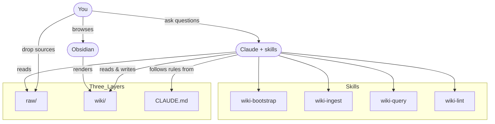

# llm-wiki

A Claude Code plugin for building and maintaining **persistent, LLM-maintained knowledge bases** in [Obsidian](https://obsidian.md/) format. One install, four skills, and any directory becomes a compounding wiki the LLM writes for you.

Based on [Andrej Karpathy's LLM Wiki](https://gist.github.com/karpathy/442a6bf555914893e9891c11519de94f), extended with scaling patterns from [agentmemory](https://github.com/rohitg00/agentmemory). Full acknowledgements in [`origin/CREDITS.md`](origin/CREDITS.md).

> **Status.** Early, not yet on a public Claude Code marketplace. Install by cloning — see [Install](#install).

## The idea in one line

Stop re-deriving knowledge with RAG every time; have the LLM **compile** it into a structured wiki that compounds over time. You curate sources and ask questions. The LLM does the rest — summarising, cross-referencing, flagging contradictions, keeping everything consistent.

Obsidian is the IDE. The LLM is the programmer. The wiki is the codebase.

For the long version, read [`origin/llm-wiki.md`](origin/llm-wiki.md) (the original pattern) and [`origin/llm-wiki-v2.md`](origin/llm-wiki-v2.md) (scaling extensions).

## What you get

Four skills, each triggered by natural language:

| Skill | Say something like… | What it does |
|---|---|---|
| **`wiki-bootstrap`** | "set up a new knowledge base here" · "build me a second brain" · "start a research vault" | Inspects the directory, interviews you about use case and domain, scaffolds `raw/` + `wiki/`, writes a tailored `CLAUDE.md` schema, seeds `index.md` / `log.md` / `overview.md`, configures `.obsidian/`. One-shot per vault. |
| **`wiki-ingest`** | "ingest this" · "add this article" · "file this paper" · "process this meeting" | Reads one source, writes a summary page in `wiki/sources/`, updates entity & concept pages, updates the index, appends to the log. Flags contradictions; does not silently overwrite existing claims. |
| **`wiki-query`** | "what does the wiki say about X?" · "query the wiki" · "compare A and B from the vault" | Searches the wiki, synthesises an answer with wikilink citations, picks the right output format (prose, table, timeline, mermaid). Offers to file substantive answers as `wiki/analysis/` pages so explorations compound. |
| **`wiki-lint`** | "lint the wiki" · "health check" · "clean up the wiki" | Runs seven checks: frontmatter drift, broken wikilinks, orphans, missing cross-references, contradictions, index freshness, overview staleness. Auto-fixes safe issues, flags the rest for you to decide. |

All four skills read the vault's `CLAUDE.md` at runtime, so the process is plugin-level but the **schema is per-vault** — each vault's conventions, entity types, and page shapes travel with it.

## Capabilities

- **Any domain.** Personal (goals, journal, self-improvement), research (topic deep-dives), book companions, business/team wikis, course notes, competitive analysis, trip planning — bootstrap interviews you and tailors the schema.
- **Obsidian-native output.** Wikilinks, callouts, YAML frontmatter, mermaid diagrams. Configured so Graph View and Dataview work out of the box.
- **Confidence scoring.** Every page carries a `0.0–1.0` confidence value; skills weigh older/newer claims and surface contradictions rather than overwriting.
- **Chronological log.** Append-only `wiki/log.md` is grep-parseable: `grep "^## \[" wiki/log.md` gives you the full timeline.
- **Safe defaults.** Bootstrap never overwrites silently; ingest never modifies `raw/`; lint never resolves contradictions unilaterally; nothing commits to git unless you ask.

## Prerequisites

- [Claude Code](https://docs.anthropic.com/en/docs/claude-code) (CLI, IDE extension, or desktop).
- [Obsidian](https://obsidian.md/) for browsing the vault (optional — everything is plain markdown).

## Install

Clone the repo once, then register it as a local marketplace in Claude Code.

```bash
# 1. Clone anywhere on your machine
git clone https://github.com/bmentges/knowledge-base-template ~/code/llm-wiki
cd ~/code/llm-wiki
```

Then, inside Claude Code:

```
/plugin marketplace add ~/code/llm-wiki
/plugin install llm-wiki@llm-wiki
```

Verify the skills are loaded — start a fresh Claude Code session and run:

```
/plugin
```

You should see `llm-wiki` listed as installed, with four skills: `wiki-bootstrap`, `wiki-ingest`, `wiki-query`, `wiki-lint`.

### Updating

```bash
cd ~/code/llm-wiki
git pull
```

Then in Claude Code: `/plugin marketplace update llm-wiki`.

### Uninstall

```
/plugin uninstall llm-wiki@llm-wiki
/plugin marketplace remove llm-wiki
```

### Fallback (if the plugin flow doesn't work yet)

The skills are plain markdown files and work as user-level skills too. Symlink them in:

```bash
mkdir -p ~/.claude/skills
for s in wiki-bootstrap wiki-ingest wiki-query wiki-lint; do
  ln -s ~/code/llm-wiki/skills/$s ~/.claude/skills/$s
done
```

Skills are then available in every Claude Code session, no plugin commands needed.

## Use

### 1. Create a new wiki

In the directory you want the vault to live:

```
Claude, set up a new knowledge base here for my research on distributed systems.
```

`wiki-bootstrap` will interview you (use case, entity types, source types, scale), show the plan, then scaffold the vault. If the directory isn't empty, it walks you through placement options — bootstrap in-place, use a subdirectory, or pick a different directory. It never overwrites existing files silently.

### 2. Open in Obsidian

```
Obsidian → Open folder as vault → select the directory
```

### 3. Daily workflow

```
# Drop an article into raw/, then:
Claude, ingest raw/2026-04-17-paxos-explained.md

# Later, ask:
Claude, what does the wiki say about consensus algorithms?

# Periodically:
Claude, lint the wiki.
```

## What a vault looks like

```
my-knowledge-base/
|
|-- raw/                        # Your source documents (immutable)
|   |-- assets/                 # Images, PDFs, attachments
|   |-- 2026-04-17-paxos-explained.md
|   +-- meeting-notes-2026-04.md
|
|-- wiki/                       # LLM-generated pages (the knowledge base)
|   |-- index.md                # Catalog of all pages with summaries
|   |-- log.md                  # Chronological record of operations
|   |-- overview.md             # High-level synthesis
|   |-- entities/               # People, projects, tools, orgs
|   |-- concepts/               # Ideas, patterns, theories
|   |-- sources/                # One summary page per ingested source
|   +-- analysis/               # Filed query results, comparisons, deep dives
|
|-- CLAUDE.md                   # Schema: rules, conventions, workflows
+-- .obsidian/                  # Obsidian vault config
```

### How the pieces connect



## Plugin layout

```
.claude-plugin/
  plugin.json                   Plugin manifest
  marketplace.json              Single-plugin marketplace (for local install)
skills/
  wiki-bootstrap/               SKILL.md + templates/
  wiki-ingest/                  SKILL.md
  wiki-query/                   SKILL.md
  wiki-lint/                    SKILL.md
origin/                         Pattern docs this plugin is based on
  llm-wiki.md                   Karpathy's original idea file
  llm-wiki-v2.md                agentmemory scaling extensions
  obsidian-conventions.md       Formatting/frontmatter/wikilink rules
  CREDITS.md                    Acknowledgements
README.md
LICENSE
```

## Scaling up

[`origin/llm-wiki-v2.md`](origin/llm-wiki-v2.md) covers advanced patterns worth adopting as your wiki grows:

- **Confidence scoring** — already part of the default schema.
- **Knowledge graph** — typed entities and relationships beyond flat wikilinks.
- **Hybrid search** — BM25 + vector + graph traversal when `index.md` outgrows a single read.
- **Automation hooks** — auto-ingest on new files in `raw/`, scheduled lint. *Not yet shipped in this plugin; tracked as future work.*
- **Consolidation tiers** — working → episodic → semantic → procedural memory.
- **Multi-agent / shared vaults** — several contributors on one wiki.

Start minimal. Add layers when you feel the need.

## Recommended Obsidian plugins

- **Graph View** (built-in) — visualize connections between pages.
- **Dataview** — query page frontmatter as structured data.
- **Obsidian Web Clipper** — browser extension to clip articles as markdown sources.
- **Marp Slides** — generate presentations from wiki content.

## Roadmap

- Hooks: auto-ingest on new files in `raw/`, scheduled lint.
- Optional search backend (e.g. [qmd](https://github.com/tobi/qmd)) for vaults past a few hundred pages.
- Publish to a public Claude Code marketplace when one stabilises.

## License

[MIT](LICENSE)

## Credits

See [`origin/CREDITS.md`](origin/CREDITS.md).
