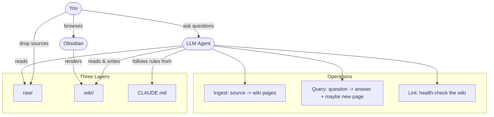

# Knowledge Base Template

A template for building persistent, LLM-maintained knowledge bases using [Obsidian](https://obsidian.md/) as the viewer and any LLM coding agent as the writer.

Based on [Andrej Karpathy's LLM Wiki](https://gist.github.com/karpathy/442a6bf555914893e9891c11519de94f) pattern, extended with lifecycle and scaling patterns from [agentmemory](https://github.com/rohitg00/agentmemory).

## The idea

Instead of uploading documents to an LLM and re-deriving answers every time (RAG), the LLM **builds and maintains a wiki** for you. You provide sources and ask questions. The LLM writes pages, cross-references entities, flags contradictions, and keeps everything consistent. The knowledge compounds over time rather than being thrown away after each chat.

You never write the wiki yourself. Obsidian is the IDE; the LLM is the programmer; the wiki is the codebase.

## Prerequisites

- [Obsidian](https://obsidian.md/) installed
- An LLM coding agent with file access. Any of these work:
  - [Claude Code](https://docs.anthropic.com/en/docs/claude-code) (CLI or IDE extension)
  - [OpenAI Codex](https://openai.com/index/codex/)
  - [Cursor](https://cursor.sh/), [Windsurf](https://codeium.com/windsurf), or any AI-enabled editor
  - Any agent that can read/write local files

## Setup

### 1. Clone this template

```bash
git clone https://github.com/bmentges/knowledge-base-template.git my-knowledge-base
cd my-knowledge-base
```

### 2. Open a conversation with your LLM agent

Open your LLM coding agent in the cloned directory. Then send it the following prompt, adapted to your use case:

---

**The prompt:**

> Help me set up this knowledge base in wiki format, using Obsidian format.
>
> Please read the files in `config/` to understand the LLM Wiki pattern. Then set up this repository as a knowledge base for **[describe your purpose here]**.
>
> Specifically:
> 1. Create the directory structure (raw sources, wiki pages, assets)
> 2. Write a `CLAUDE.md` (or equivalent schema file) tailored to my use case, defining page types, entity types, naming conventions, ingest/query/lint workflows, and cross-referencing rules
> 3. Create the initial `wiki/index.md` and `wiki/log.md` files
> 4. Create a starter overview page in the wiki
> 5. Configure `.obsidian/` settings if needed (attachment folder, etc.)
>
> My use case: **[fill in one of the following, or write your own]**
> - *Personal*: tracking goals, health, psychology, self-improvement, journal entries, articles, podcast notes
> - *Research*: deep-diving a topic over weeks/months with papers, articles, reports, and an evolving thesis
> - *Book companion*: reading a book chapter by chapter, building pages for characters, themes, plot threads
> - *Business*: internal knowledge base fed by meeting notes, Slack threads, project docs, customer calls
> - *Course notes*: structured study wiki for a class or certification
> - *Other*: [describe it]

---

### 3. Open in Obsidian

Once the LLM finishes the setup:

```
Open Obsidian -> Open folder as vault -> select your cloned directory
```

You now have a live wiki. The LLM writes; you browse.

## What it looks like after setup

```
my-knowledge-base/
|
|-- config/                     # Template docs (you can delete after setup)
|   |-- LLM-WIKI.md
|   +-- LLM-WIKI-v2.md
|
|-- raw/                        # Your source documents (immutable)
|   |-- assets/                 # Images, PDFs, attachments
|   |-- article-on-topic-x.md
|   |-- meeting-notes-2026-04.md
|   +-- paper-something.pdf
|
|-- wiki/                       # LLM-generated pages (the knowledge base)
|   |-- index.md                # Catalog of all pages with summaries
|   |-- log.md                  # Chronological record of operations
|   |-- overview.md             # High-level synthesis of everything
|   |-- entities/               # People, projects, tools, orgs
|   |   |-- redis.md
|   |   +-- project-alpha.md
|   |-- concepts/               # Ideas, patterns, theories
|   |   |-- caching-strategies.md
|   |   +-- event-driven-architecture.md
|   |-- sources/                # One summary page per ingested source
|   |   |-- article-on-topic-x.md
|   |   +-- paper-something.md
|   +-- analysis/               # Filed query results, comparisons, deep dives
|       +-- redis-vs-memcached.md
|
|-- CLAUDE.md                   # Schema: rules, conventions, workflows
+-- .obsidian/                  # Obsidian vault config
```

### How the pieces connect



## Daily workflow

Once set up, your workflow is three operations:

| Operation | What you do | What the LLM does |
|-----------|------------|-------------------|
| **Ingest** | Drop a source into `raw/` and say "ingest this" | Reads the source, writes a summary page, updates entity/concept pages, updates `index.md`, appends to `log.md` |
| **Query** | Ask a question | Searches the wiki, synthesizes an answer. Good answers get filed as new wiki pages |
| **Lint** | Say "lint the wiki" | Finds orphan pages, stale claims, missing cross-references, contradictions. Fixes what it can, flags the rest |

## Scaling up

The `config/LLM-WIKI-v2.md` file describes advanced patterns you can adopt as your wiki grows:

- **Confidence scoring** -- facts carry weight based on source count and recency
- **Knowledge graph** -- typed entities and relationships, not just flat pages
- **Hybrid search** -- BM25 + vector + graph traversal when `index.md` gets too big
- **Automation hooks** -- auto-ingest on new files, auto-lint on schedule
- **Consolidation tiers** -- working memory -> episodic -> semantic -> procedural
- **Multi-agent** -- multiple LLMs or people contributing to the same wiki

Start minimal. Add layers when you feel the need.

## Recommended Obsidian plugins

- **Graph View** (built-in) -- visualize connections between pages
- **Dataview** -- query page frontmatter as structured data
- **Obsidian Web Clipper** -- browser extension to clip articles as markdown sources
- **Marp Slides** -- generate presentations from wiki content

## License

[MIT](LICENSE)

## Credits

- [Andrej Karpathy](https://gist.github.com/karpathy/442a6bf555914893e9891c11519de94f) -- original LLM Wiki idea
- [agentmemory](https://github.com/rohitg00/agentmemory) -- lifecycle and scaling patterns (v2)
